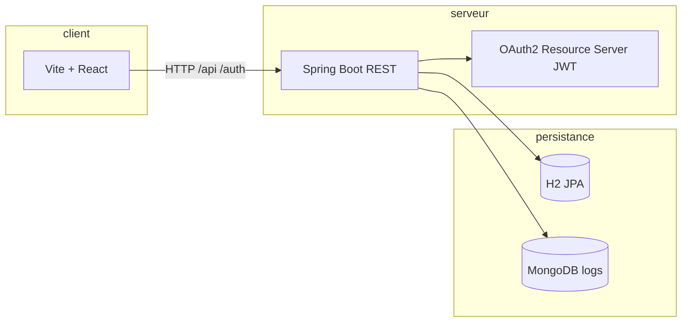

# Architecture — Fantasy World

Ce dépôt regroupe une **API REST** (Spring Boot) et une **interface web** (React, Vite). La description contractuelle de l’API est au format **OpenAPI 3.1** dans `documentation/openapi/aventurier.openapi.yml` et sert de source à la génération de code (backend Maven, frontend `openapi-typescript`).

## Vue d’ensemble

- En **développement**, le front proxifie `/api` et `/auth` vers `http://localhost:8080` (voir `frontend/vite.config.ts`).
- **Contrat unique** : `documentation/openapi/aventurier.openapi.yml`.

## Backend (`backend/`)

| Couche | Rôle |
|--------|------|
| `infra.controller` | Implémente les interfaces générées par OpenAPI (`*Api`) et traduit HTTP ↔ services. |
| `service` | Règles métier et orchestration (`AventurierService`, `CompetenceService`, `AuthService`). |
| `domain` | Modèles, DTO et exceptions métier (ex. prérequis, règles de niveau). |
| `infra.dao` | Entités JPA, repositories, documents Mongo pour les journaux d’API. |
| `infra.security` | Chaîne de filtres Spring Security, JWT (émission, validation, révocation au logout). |
| `infra.exception` | `GlobalExceptionHandler` : erreurs en `application/problem+json` (RFC 9457). |

### Persistance

- **H2** (mémoire) pour les données métier aventuriers / compétences / utilisateurs (`backend/src/main/resources/application.yaml`).
- **MongoDB** pour la journalisation des appels API (`ApiLog`, aspect `ApiLoggingAspect`). En dev, Mongo embarqué (Flapdoodle) peut être utilisé selon la configuration.

### Sécurité

- Endpoints publics : `POST /auth/register`, `POST /auth/login`.
- Lecture (`GET`) sur `/api/v1/**` : rôles `VIEWER` ou `ADMIN`.
- Écriture (création, mise à jour, suppression, attribution de compétences) : rôle `ADMIN` uniquement.
- Les autorités sont dérivées de la revendication JWT `scope` (préfixe d’autorité vide, valeurs `ROLE_VIEWER` / `ROLE_ADMIN`).

### Codes HTTP métier notables

- **422** : prérequis d’une compétence non satisfaits lors d’une attribution — le corps inclut `prerequisManquants`.
- **409** : conflit de règle métier (niveau d’aventurier, suppression de compétence utilisée, modification de compétence incohérente avec des possesseurs — voir `aventuriersImpactes` dans le Problem Detail).

## Frontend (`frontend/`)

- React 19, routage avec React Router.
- Appels HTTP via services (`src/services/*`) et client typé à partir du contrat OpenAPI.
- Authentification : stockage du jeton, en-tête `Authorization: Bearer …` sur les requêtes protégées.

## Documentation API

- Spécification : `documentation/openapi/aventurier.openapi.yml` (info `1.1.0`).
- Génération serveur : plugin Maven `openapi-generator-maven-plugin` dans `backend/pom.xml` (phase `generate-sources`, générateur `spring`, `interfaceOnly`).

Pour valider ou visualiser le contrat, importer ce fichier dans Swagger UI, Stoplight ou un IDE compatible OpenAPI.
